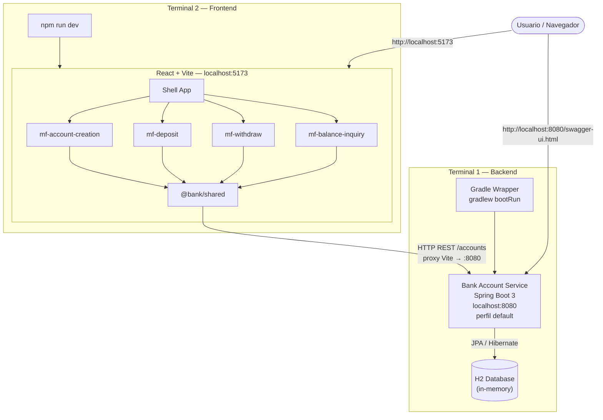
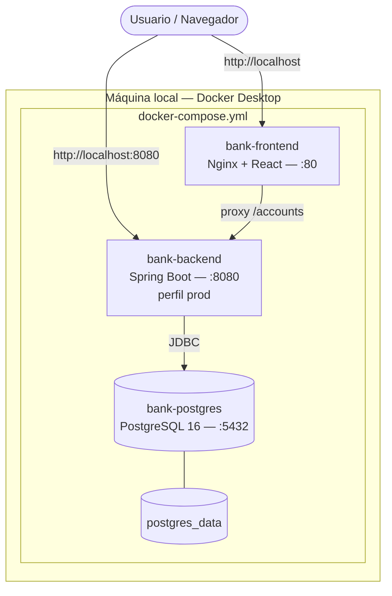

# Bank Account Application

Microservicio bancario desarrollado con **Spring Boot 3** para la gestión de cuentas bancarias. Permite crear cuentas, realizar consignaciones, retiros y consultar saldos, aplicando principios **SOLID**, arquitectura por capas y buenas prácticas de desarrollo.

## Tecnologías

| Tecnología | Versión |
|---|---|
| Java | 17 |
| Spring Boot | 3.2.5 |
| Gradle | 8.x |
| H2 Database | In-memory |
| Spring Data JPA | - |
| SpringDoc OpenAPI (Swagger) | 2.5.0 |
| JUnit 5 + Mockito | - |
| Lombok | - |

## Arquitectura

El proyecto sigue una **arquitectura por capas** con separación clara de responsabilidades:

```
com.bank.account
├── config          → Configuración (Swagger/OpenAPI)
├── constants       → Constantes de API y mensajes de error
├── controller      → Capa REST (endpoints HTTP)
├── dto
│   ├── request     → DTOs de entrada
│   └── response    → DTOs de salida
├── entity          → Entidades JPA
├── enums           → Enumeraciones de dominio
├── exception       → Excepciones y manejo global
├── mapper          → Conversión Entity ↔ DTO
├── repository      → Capa de persistencia (Spring Data JPA)
├── service
│   ├── impl        → Implementación de la lógica de negocio
│   └── AccountService
├── util            → Utilidades de validación
└── BankAccountApplication
```

### Patrones aplicados

- **Repository**: Abstracción de acceso a datos (`CuentaBancariaRepository`, `TransaccionRepository`)
- **DTO**: Separación entre contrato de API y entidades de dominio
- **Builder**: Construcción de objetos con Lombok `@Builder` en entidades y DTOs
- **Service Layer**: Lógica de negocio encapsulada en `AccountService`

### Principios SOLID

- **S** — Cada clase tiene una única responsabilidad (Controller, Service, Repository, Mapper)
- **O** — Extensible mediante interfaces (`AccountService`)
- **L** — Implementaciones intercambiables (`AccountServiceImpl`)
- **I** — Interfaces segregadas por operación de negocio
- **D** — Inyección de dependencias por constructor (`@RequiredArgsConstructor`)

## Endpoints

| Método | Endpoint | Descripción |
|---|---|---|
| `POST` | `/accounts` | Crear una nueva cuenta bancaria |
| `POST` | `/accounts/{id}/deposit` | Realizar consignación |
| `POST` | `/accounts/{id}/withdraw` | Realizar retiro |
| `GET` | `/accounts/{id}/balance` | Consultar saldo |

### Request / Response

**Crear cuenta** — `POST /accounts`
```json
// Request
{ "titular": "Juan Pérez" }

// Response 201
{
  "id": 1,
  "titular": "Juan Pérez",
  "saldo": 0.00,
  "fechaCreacion": "2026-07-01T10:00:00"
}
```

**Consignación / Retiro** — `POST /accounts/{id}/deposit` | `/withdraw`
```json
// Request
{ "monto": 150.50 }

// Response 200
{
  "transaccionId": 1,
  "cuentaId": 1,
  "titular": "Juan Pérez",
  "tipo": "DEPOSITO",
  "monto": 150.50,
  "saldo": 150.50,
  "fecha": "2026-07-01T10:05:00"
}
```

**Consultar saldo** — `GET /accounts/{id}/balance`
```json
// Response 200
{
  "id": 1,
  "titular": "Juan Pérez",
  "saldo": 150.50
}
```

## Reglas de negocio

- El saldo inicial al crear una cuenta es **0**
- Los montos de transacción deben ser **positivos** (> 0)
- Un retiro no puede superar el **saldo disponible**
- El titular debe tener entre **1 y 100 caracteres**
- Toda validación fallida genera un log y una respuesta HTTP descriptiva

## Requisitos previos

- JDK 17+
- Gradle 8+ (o usar el wrapper incluido)

## Ejecución

```bash
# Clonar el repositorio
git clone <url-repositorio>
cd BankAccountApplication

# Compilar y ejecutar tests
./gradlew build

# Iniciar la aplicación
./gradlew bootRun
```

En Windows:
```powershell
.\gradlew.bat build
.\gradlew.bat bootRun
```

La aplicación estará disponible en: **http://localhost:8080**

## Swagger / OpenAPI

Documentación interactiva disponible en:

- **Swagger UI**: http://localhost:8080/swagger-ui.html
- **OpenAPI JSON**: http://localhost:8080/api-docs

## Consola H2

Base de datos en memoria accesible en:

- **URL**: http://localhost:8080/h2-console
- **JDBC URL**: `jdbc:h2:mem:bankdb`
- **Usuario**: `sa`
- **Contraseña**: *(vacía)*

## Pruebas unitarias

```bash
./gradlew test
```

Las pruebas cubren:
- Creación de cuenta con saldo inicial en cero
- Retiro exitoso con saldo suficiente
- Retiro fallido por saldo insuficiente
- Retiro fallido por cuenta inexistente

## Colección Postman

Importar el archivo `postman/Bank-Account-API.postman_collection.json` en Postman.

Variables de entorno:
- `baseUrl`: `http://localhost:8080`
- `accountId`: ID de la cuenta creada

## Frontend (React + Microfrontends)

Portal web desarrollado con **React 18 + TypeScript + Vite**, organizado en arquitectura de **microfrontends**.

### Microfrontends

| Módulo | Paquete | Responsabilidad |
|---|---|---|
| **Shell App** | `frontend/src` | Contenedor principal que orquesta los microfrontends |
| **Account Creation** | `@bank/mf-account-creation` | Formulario de creación de cuentas bancarias |
| **Deposit** | `@bank/mf-deposit` | Consignaciones (depósitos) en cuentas |
| **Withdraw** | `@bank/mf-withdraw` | Retiros de cuentas bancarias |
| **Balance Inquiry** | `@bank/mf-balance-inquiry` | Consulta de saldo por ID de cuenta |
| **Shared** | `@bank/shared` | API client, tipos y estilos compartidos |

### Estructura frontend

```
frontend/
├── src/                          → Shell App (host)
├── packages/
│   ├── shared/                   → Librería compartida
│   ├── mf-account-creation/      → Microfrontend: crear cuenta
│   ├── mf-deposit/               → Microfrontend: consignaciones
│   ├── mf-withdraw/              → Microfrontend: retiros
│   └── mf-balance-inquiry/       → Microfrontend: consultar saldo
├── package.json
└── vite.config.ts
```

### Requisitos

- Node.js 18+
- npm 9+

### Ejecución

```bash
# Terminal 1 — Backend
.\gradlew.bat bootRun

# Terminal 2 — Frontend
cd frontend
npm install
npm run dev
```

Portal disponible en: **http://localhost:5173**

El frontend usa un proxy de Vite hacia `http://localhost:8080` para las peticiones `/accounts`.

### Logs y diagnóstico de fallos

**Backend** — Los logs usan prefijos para identificar rápidamente la operación:

| Prefijo | Operación |
|---|---|
| `[CREAR_CUENTA]` | Creación de cuenta |
| `[DEPOSITO]` / `[RETIRO]` | Transacciones |
| `[CONSULTA_SALDO]` | Consulta de saldo |
| `[BUSCAR_CUENTA]` | Búsqueda de cuenta |
| `[VALIDAR_MONTO]` | Validación de monto |
| `[ERROR-400/404/500]` | Errores capturados globalmente |

Ejemplo de log de fallo:
```
2026-07-01 10:05:00 [http-nio-8080-exec-1] WARN  c.b.a.e.GlobalExceptionHandler - [ERROR-400] POST /accounts/1/withdraw - Saldo insuficiente: Saldo insuficiente...
```

**Frontend** — Abrir DevTools (F12) → Consola. Los logs usan prefijos `[API:...]` y `[SHELL]`.

Ejemplo:
```
[2026-07-01T10:05:00.000Z] [API:RETIRO] Fallo - HTTP 400: Saldo insuficiente...
```

### Flujo de integración

1. El usuario crea una cuenta en **mf-account-creation**
2. El Shell App propaga el ID de cuenta activa a los demás microfrontends
3. **mf-deposit** y **mf-withdraw** permiten realizar transacciones sobre esa cuenta
4. **mf-balance-inquiry** se actualiza automáticamente tras cada transacción
5. Todos los microfrontends consumen la API REST del backend Spring Boot

## Proceso de despliegue (Punto 6 — Extra)

Documentación completa en [`docs/DEPLOYMENT.md`](docs/DEPLOYMENT.md).

### Resumen del proceso

```
Desarrollo local          Docker (demo/staging)         Producción (cloud)
─────────────────         ─────────────────────         ──────────────────
gradlew bootRun      →    docker compose up      →     ECS / K8s / Cloud Run
H2 in-memory              PostgreSQL + Nginx            RDS PostgreSQL + API Gateway + ALB
localhost:8080            localhost:80                  dominio público
```

### Despliegue rápido con Docker

```bash
# Requisito: Docker Desktop instalado
docker compose up --build -d
```

| Servicio | URL |
|---|---|
| Portal web | http://localhost |
| API REST | http://localhost:8080 |
| Swagger | http://localhost:8080/swagger-ui.html |

### Componentes de despliegue

| Archivo | Propósito |
|---|---|
| `Dockerfile` | Imagen del microservicio Spring Boot (multi-stage) |
| `frontend/Dockerfile` | Imagen del frontend React + Nginx |
| `docker-compose.yml` | Orquestación: backend + frontend + PostgreSQL |
| `application-prod.yml` | Perfil de producción con PostgreSQL |
| `docs/DEPLOYMENT.md` | Proceso detallado + CI/CD + cloud |

### Decisiones de despliegue

- **H2** solo en desarrollo; **PostgreSQL** en despliegue real (datos persistentes).
- **Docker multi-stage**: imagen final ligera (~200 MB) sin herramientas de build.
- **Nginx** como reverse proxy: el frontend llama a `/accounts` y Nginx redirige al backend.
- **CI/CD propuesto**: build → test → docker push → deploy (GitHub Actions / Jenkins).
- **Cloud**: arquitectura con API Gateway + ALB + ECS + RDS (AWS) documentada en `docs/DEPLOYMENT.md`.

## Diagrama de despliegue

Diagramas en **Mermaid** (se renderizan en GitHub). Código fuente en archivos separados:

| Escenario | Archivo | Comando |
|---|---|---|
| **Sin Docker** (desarrollo local) | [`docs/deployment-sin-docker.mmd`](docs/deployment-sin-docker.mmd) | `gradlew bootRun` + `npm run dev` |
| **Con Docker** (Compose) | [`docs/deployment-docker.mmd`](docs/deployment-docker.mmd) | `docker compose up --build -d` |
| Cloud (AWS) | [`docs/deployment-cloud.mmd`](docs/deployment-cloud.mmd) | Ver [`docs/DEPLOYMENT.md`](docs/DEPLOYMENT.md) |

Previsualizar en: https://mermaid.live

### Sin Docker (desarrollo local)



### Con Docker (Docker Compose)



| Contenedor | Build / Imagen | Puerto |
|---|---|---|
| `bank-frontend` | `frontend/Dockerfile` | 80 |
| `bank-backend` | `Dockerfile` | 8080 |
| `bank-postgres` | `postgres:16-alpine` | 5432 |

## Estructura de entidades

**CuentaBancaria**
| Campo | Tipo |
|---|---|
| id | Long |
| titular | String |
| saldo | BigDecimal |
| fechaCreacion | LocalDateTime |

**Transaccion**
| Campo | Tipo |
|---|---|
| id | Long |
| cuentaBancaria | CuentaBancaria |
| tipo | Enum (DEPOSITO, RETIRO) |
| monto | BigDecimal |
| fecha | LocalDateTime |

## Autor

Prueba Técnica — Desarrollador Jair Felipe Sanchez
